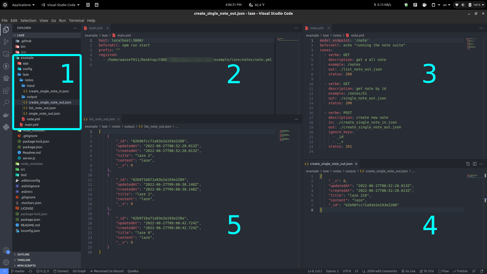

## Laze (this readme is still a to-do)

-  create the main YAML file containing a "before" script to seed and start the server on the provided port and host...
-  register each (model/entity/database table) or whatever you want to call it ... each registred model is a YAML file describing tests suites with cases containing key pairs for (payload/response)  and status.
- from terminal or pipeline: **$ laze run=./main.yaml --dryRun** will parse the provided main file and all the registred files + run validation they exist in the proper form...
- **(easy to do)** just run the actual http requests and assert values match the defined...
- **(easy to do)** use a **DTO** for rock-solid validation...
- **(medium to do)** support multiple nested resources **eg. :muni/:user/:things**
- **(medium to do)** support **JWT** with with a **BeforeSuiteScript** to generate an access token for each suite or for all.

_________________________________
**technical details**
for the demo, used https://oclif.io/(by salesforce) to build the cli.. it takes care of versioning/scaffolding/documenting...

